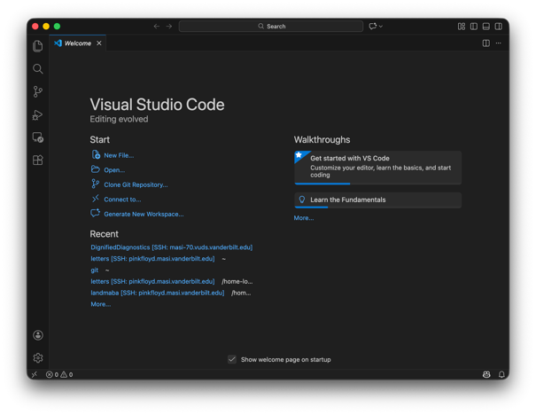
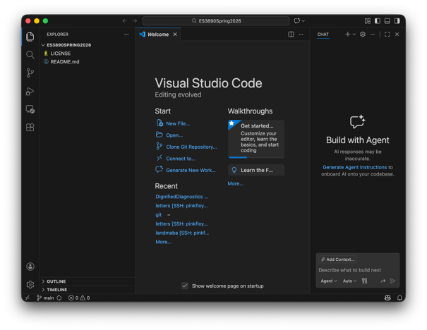
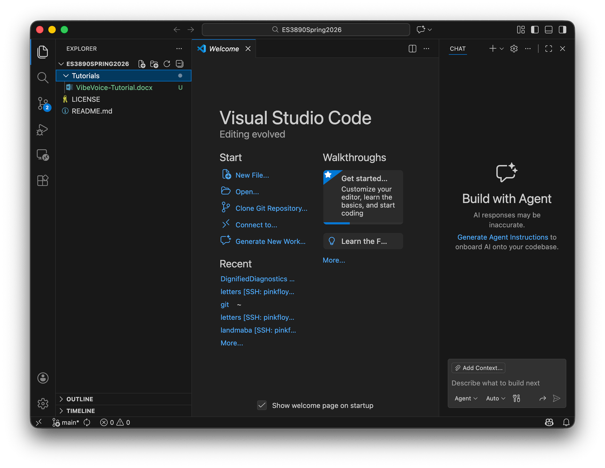
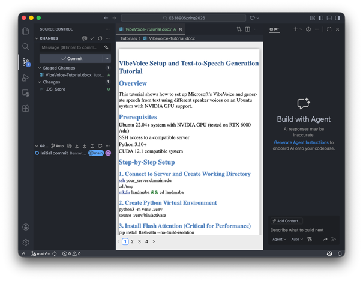
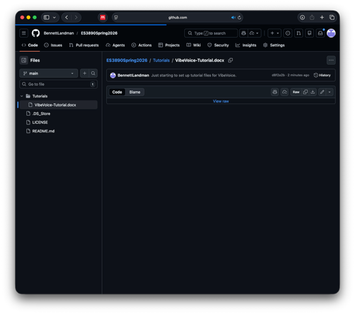
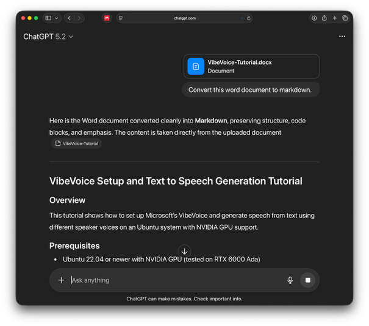
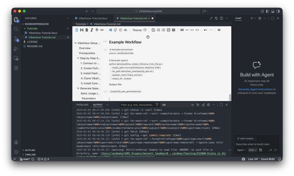
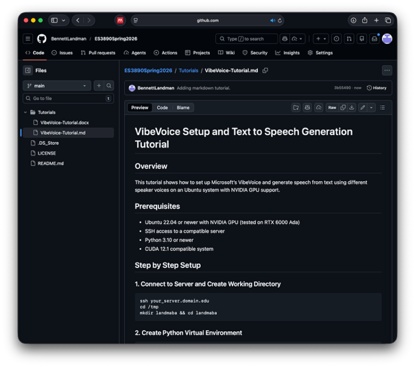

# Setting Up a Repository in GitHub

Created Repository in GitHub:


I’m using VSCode:


<https://code.visualstudio.com>


Clone from GitHub: https://github.com/BennettLandman/ES3890Spring2026.git








Create a folder for tutorials / HowTo (incuding my VibeVoice tutorial from earlier this term):





Add new files to GitHub:





Finish setup of GitHub by setting my username and e-mail on the terminal:


```bash
git config --global user.name "Bennett Landman"
```


```bash
git config --global user.email "bennett.landman@vanderbilt.edu"
```


Note that “Commit” is local only. “Commit & Push” sends to GitHub.


We can now see the result on the GitHub website, BUT the file is binary and we have to download it.





To convert to markdown, I use an LLM (but there are tons of ways).





I then copy/paste into a new file in VSCode, save and commit/push:





Poof! The tutorial is now nicely viewable on the GitHub website:





